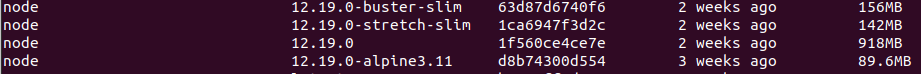
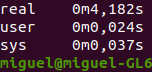
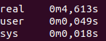

# Base image selection

First of all, I had to look in Docker Hub documentation about [node](https://hub.docker.com/_/node). We can see that there are so many options, since I am using 
node 12.19.0 I had to install one of the images that matches my version.

- Versions

  - node:<version>: 
  This is the defacto image. It is designed to be used both as a throw away container, as well as the base to build other images off of.

  - node:<version>-alpine:
  This image is based on the popular Alpine Linux project, Alpine is lighter than most of the images. This version is better when you want to image to be as small
  as possible, it is also one of the safest options.This image is the most highly recommended if space is a concern.
  
  - node:<version>-slim: 
  This image uses the minimal packages needed in order to function correctly. It is better than node:<version> in most of the cases.
  
  - node:<version>-buster:
  It is a Debian base image for Debian 10.4 stable releases. In version 9 instead of buster they use the name stretch.
  
  
 ## Comparison
 
 If we look at the images size we can see that node:alpine-3.11 version is smaller than the others. 
 
 
 
- node:12.19.0-alpine3.11: 4,18s

 
 - node:12.19.0: 7,3s
 
 
 
 - node:12.19.0-stretch-slim: 4,61s
 
 
 
 ## Final choice
 
 Taking everything into account, I think node:12.19.0-alpine3.11 is the best option. Why? Is the smallest and the fastest, so it is enough to be slightly 
 better than the others.
