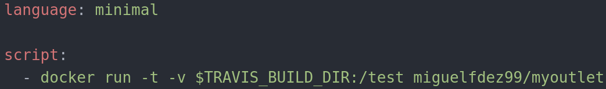

# Continuous integration

CI is a development practice that requires developers to integrate code into a shared repository several times a day. Each check-in is then verified by an automated build, allowing teams to detect problems early.
I have to use two continuous integration systems, one is Travis which is mandatory, the other one will be Shippable.

## Travis

Travis is one of the most popular continuous integration systems. You can use it
with GitHub and Bitbucket, it is also free source but it has a limited amount of credits, then you have to pay if you want to keep using it. Although it is
more than enough for this project.

The first thing we have to do is signing up in Travis, then we grant permissions
in order to sync them and create a .travis.yml file.

- language: specifies the language I use. Minimal in this case.
[Minimal](https://docs.travis-ci.com/user/languages/minimal-and-generic/) is optimized to be faster and use less disk space. Also, it contains Docker.

-script: run the build script. $TRAVIS_BUILD_DIR is an environment variable wich indicates the absolute path to the directory where the repository being built has been copied on the worker.

Previously I have the pull command to my image but it doesn't need it since Travis pull the image if it doesn't find it locally. This is what Travis does:

~~~
$ docker run -t -v $TRAVIS_BUILD_DIR:/test miguelfdez99/myoutlet
Unable to find image 'miguelfdez99/myoutlet:latest' locally
latest: Pulling from miguelfdez99/myoutlet
Status: Downloaded newer image for miguelfdez99/myoutlet:latest
~~~
