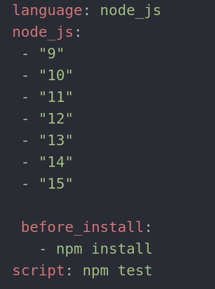
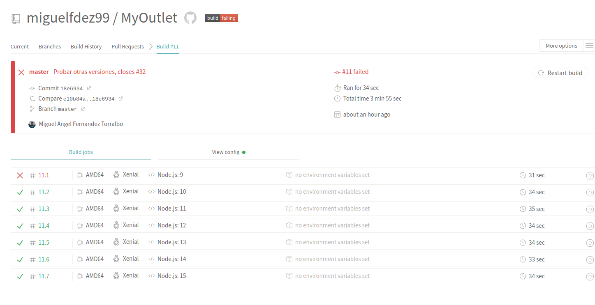
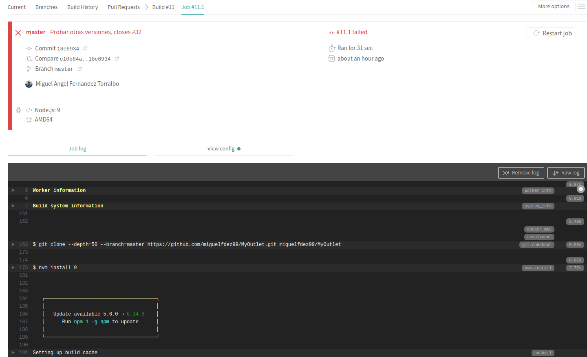

# Continuous integration

CI is a development practice that requires developers to integrate code into a shared repository several times a day. Each check-in is then verified by an automated build, allowing teams to detect problems early.
I have to use two continuous integration systems, one is Travis which is mandatory, the other one will be Shippable.

## Travis

Travis is one of the most popular continuous integration systems. You can use it
with GitHub and Bitbucket, it is also free source but it has a limited amount of credits, then you have to pay if you want to keep using it. Although it is
more than enough for this project.

The first thing we have to do is signing up in Travis, then we grant permissions
in order to sync them. We can see it in the 9 of the [TDD exercices](https://github.com/miguelfdez99/Ejercicios-IV/blob/main/docs/ic.md)

I am going to test it in six version, from version 9 of nodejs to version 15.
This is the code, to do this I have look into [Travis documentation for nodejs](https://docs.travis-ci.com/user/languages/javascript-with-nodejs/)

It executes different versions of nodejs, since this versions uses differents versions of npm and nvm in some of them may don't work.

As we can see we have an error in version 9, this is the error:

It doesn't work because the npm is too old, so with older versions than 10 it won't work. I have to remove nodejs "9" and it will work just fine.
