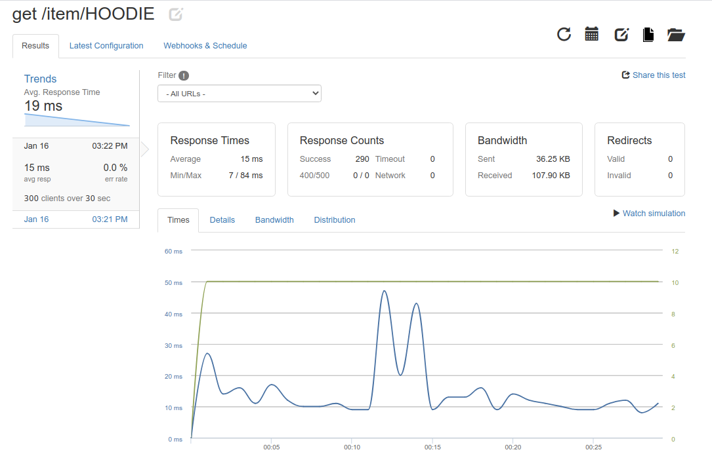

# Database

MongoDB is the best choice for a simple application like this one, also Mongo uses documents in JSON format.
I've previously work with MongoDB and I am more comfortable using it than using a MySQL dstabase.
MongoDB Atlas has a free plan where you can have 512MB of memory.
It is easy to connect it with the application or the mongo shell.
I've used mongoose which is a tool for object modeling and for working asynchronously.
With mongoose it is really easy to connect our application with MongoDB Atlas:

 `mongoose.connect(${process.env.MONGO_URI}, { useNewUrlParser: true, useUnifiedTopology: true });`

In order to make it work in Heroku I had to set the environment variable there aswell.


# Logs

Heroku provides logs for the application `heroku logs` or `heroku logs --tail`


# Load Balance

For the load balance I've used an add-on that Heroku provides loader.io. To install loader.io you have to verify your heroku account. In order to get started you have to upload a token to an url.

```
app.get('/loaderio-09aa6ee6b866095a506985cc2a61163d', function(req,res){
  res.send('loaderio-09aa6ee6b866095a506985cc2a61163d');
})

```
When this is done it allows you to run tests.





The tests are for 300 clients over 30 seconds, we can see that the results are not bad considering that the MongoDB cluster it's on Virginia. The more data it has to get the more time it takes so makes sense.
