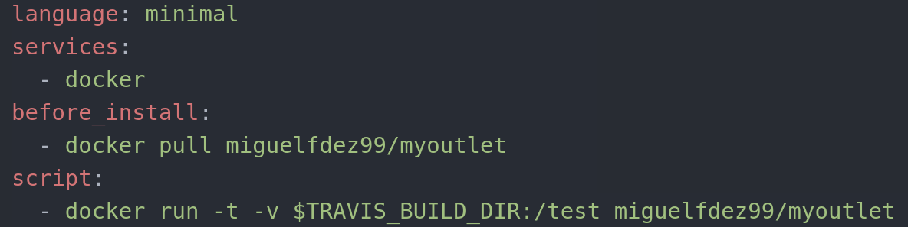

## CI with Docker

I have to change one of the continuous integration systems, I am going to use TravisCI. First thing we have to do is to modified our .travis.yml file.

This is the new code:

- minimal image contains Docker
- We download the image with pull
- $TRAVIS_BUILD_DIR is an environment variable wich indicates the absolute path to the directory where the repository being built has been copied on the worker.

Just like that we have our Docker image running with Travis.
