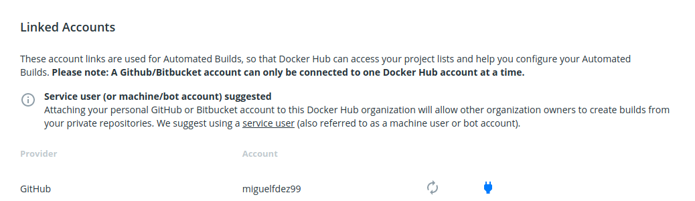
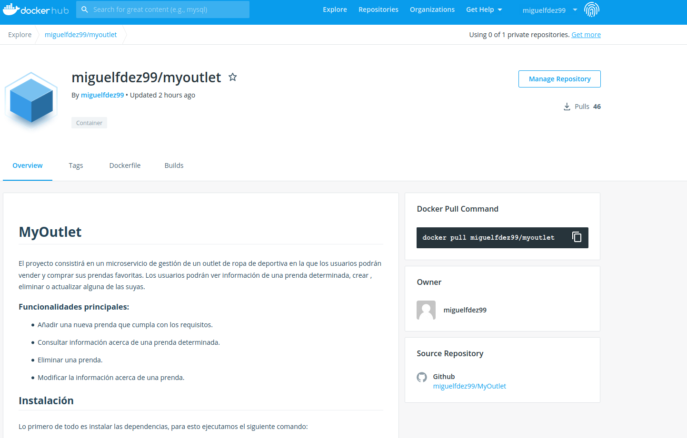

# Docker Hub

## What is Docker Hub?
Docker Hub is a hosted repository service provided by Docker for finding and sharing container images with your team. Key features include: Private Repositories: Push and pull container images. Automated Builds: Automatically build container images from GitHub and Bitbucket and push them to Docker Hub.
[Source](https://www.docker.com/products/docker-hub)

The first thing we have to do once we already have an account is to create a new repository. We can connected it with our GitHub account in order to have them 
synchronized.

Once we have our GitHub account connected we can vinculate our project's repository with the one in DockerHub and whenever it is pushed it will update our Docker Hub 
repository.

