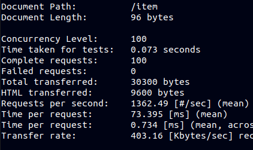
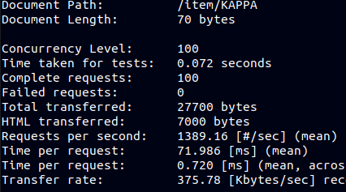
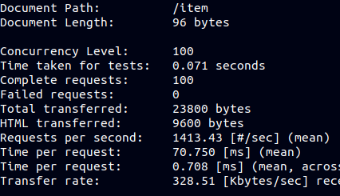
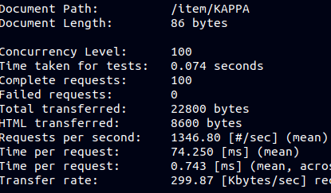

# What is the best framework for my project?

Choosing the right framework it's not an easy task, there are a lot of good frameworks. Some of them are better than the others in a particular task and vice versa. I am going to compare four frameworks in order to choose one of them.

### Express
- Express only require a basic undertanding of node.js.
- URL-based routing mechanism using HTTP
- Robust and scalable
- Easy learning curve
- Provides plugins to boost its functionality

### Sails
- Auto-generate REST API
- Integration of Express for HTTP
- ORM for framework compatibility with databases
- Support web socket

### Nest
- Ensure modular architecture for complete development flexibility
- High compatibility with Angular on the frontend
- CLI for a modular structure & features
- Flexible

### Fastify
- Provides APIs working with routes, middleware, req/res validation...
- Provides extensibility via hooks, plugins, and decorators.
- Suitable for JSON schema
- Easy way to use loggers.

## Time comparison
Considering the previous facts, I'm going to choose between Express and Fastify.
I have implemented HU:01, 02 and 07 to compare times.

#### Express code and benchmark

```
const express = require('express');
const app = express();

const port = process.env.port || 8080

const MyOutlet = require('./myoutlet.js');
const Item = require('./item.js');
let myoutlet = new MyOutlet();

var bodyParser = require('body-parser')
app.use( bodyParser.json() );       // to support JSON-encoded bodies
app.use(bodyParser.urlencoded({     // to support URL-encoded bodies
  extended: true
}));

app.get('/', function (req, res) {
    res.status(200).json('API is running');
});

app.get('/item/:brand', function(req,res){
  let brand = req.params.brand;
  try{
    res.status(200).json(myoutlet.brandInfo(brand))
  }catch(error){
    res.sendStatus(400)
    throw error;
  }
})

app.route('/item')
  .get(function(req,res){
    try{
      res.send({'Items': myoutlet.showItems()});
    }catch(error){
      res.sendStatus(404)
      throw error;
    }
  })

  .post(function(req,res){
    let type = req.body.type;
    let size = req.body.size;
    let brand = req.body.brand;
    let color = req.body.color;
    let price = req.body.price;
    let season = req.body.season;
    try{
      let item = new Item(type,size,brand,color,price,season)
      myoutlet.addItem(item);
      res.sendStatus(201)
    }catch(error){
      res.sendStatus(400)
      throw error;
    }
  })


app.listen(port);
console.log('Server running at localhost:'+port+'/');

module.exports = app
```

GET /item



- Requests per second: 1362.49
- Time per request: 73.395ms


GET /item/:brand



- Requests per second: 1389.16
- Time per request: 71.986ms

#### Fastify code and benchmark

```
const MyOutlet = require('./myoutlet.js');
const Item = require('./item.js');
let myoutlet = new MyOutlet();

const fastify = require('fastify')({logger: true})

fastify.register(require('fastify-formbody'))

const start = async () => {
    try {
      await fastify.listen(8000)
    } catch (err) {
      fastify.log.error(err)
      process.exit(1)
    }
}

fastify.get('/', async (req, res) => {
    return { aplicacion: 'MyOutlet' }
})

fastify.get('/item', async (req, res) => {
  try{
    return ({'Items': myoutlet.showItems()});
  }catch(error){
    res.code(404)
    throw error;
  }
})

fastify.post('/item', async (req, res) => {
  let type = req.body.type;
  let size = req.body.size;
  let brand = req.body.brand;
  let color = req.body.color;
  let price = req.body.price;
  let season = req.body.season;
  try{
    let item = new Item(type,size,brand,color,price,season)
    myoutlet.addItem(item);
    res.code(201)
  }catch(error){
    res.code(400)
    throw error;
  }
})

fastify.get('/item/:brand', async (req, res) => {
  let brand = req.params.brand;
  try{
    return ({'Items/brand': myoutlet.brandInfo(brand)});
  }catch(error){
    res.code(400)
    throw error;
  }
})


const close = async () => {
    try {
      await fastify.close()
    } catch (err) {
      fastify.log.error(err)
      process.exit(1)
    }
}
start()

module.export = start;
module.exports.close = close;
```


GET /item



- Requests per second: 1413.43
- Time per request: 70.750ms


GET /item/:brand



- Requests per second: 1346.80
- Time per request: 74.250ms

## Conclusion

Considering all this facts I have chosen Express. Times are pretty much the same and I have found Express easier to understand. Also, Express it's perfect for a small job like this microservice.
