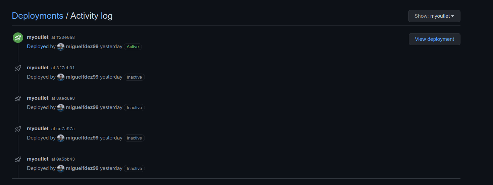

# Heroku

I have chosen Heroku to deploy my application. Somo of the reasons are:
  - Heroku has a free plan.
  - Easy to install and use
  - Has its own CI, although it's not free.
  - It can be automatic deployed from GitHub when the CI of your repo passes.
  - You can use add-ons and builpacks.
  - Provides two ways for deploying with Docker.
  - Can be tested locally with `heroku local` or `foreman`
  - Provides it's own logs `heroku logs` or `heroku logs --tail` to see it in real-time.
  - Easy to set your secrets variables.

  Others platforms like DigitalOcean or Dokku has no free-plan.

# Automatic Deploys

There are differents ways to deploy on Heroku, the first one that I tried was deplyment with Git.

The first I had to do was installing Heroku CLI, after that I created my app with `heroku create`. Once the app is created you can deploy it to Heroku using `git push heroku master`. Obviously we don't wanna do this every time we want to deploy it to Heroku. That's why we need an automatic deployment.
Heroku uses a Procfile to specify the commands that are executed by the app on startup. My procfile: `web: node ./app/index.js `

You can enable automatic deploys from GitHub, it has the option to only deploy it when CI passes. So, the deployment will only take place when Travis tests are OK.

I also has a deployment from CloudBees Codeship, where you can add a deplyment to a pipeline with just choosing Heroku and providing Heroku API Key. I installed it for the PaaS exercises, I don't think I need it since I have the other configuration aswell, but I guess it's not bad to have it in case my Travis credits runs out.

