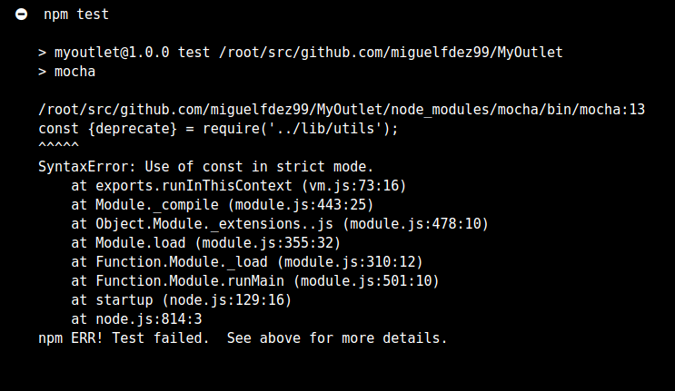

# Shippable

There are several continuous integration systems Shippable,Jenkins,CircleCI,CodeShip,GitLab CI, etc. I have chosen Shippable after look into some of this tools, but I found Shippable easiest and simpler than the others. It is very well [documented](http://docs.shippable.com/ci/why-continuous-integration/) too.
[Shippable](http://docs.shippable.com) helps developers achieve CI/CD and make software releases frequent, predictable, and error-free.

You can sign up with GitHub and to use it you simply authorize Shippable to access to GitHub

I only have unit tests so that's why is going to be the same that TravisCI for now. In the next weeks I will use Shippable for **integration testing**, right now I can't do it since it is not inclided yet.

Code for .shippable.yml:

In the last part, we install npm and execute the test.

~~~
cache: true
 cache_dir_list:
   - $SHIPPABLE_BUILD_DIR/node_modules
~~~

This is for avoiding installing node modules each time.

I have this error in older versions:

So I am using the last version available 11.10.0.
