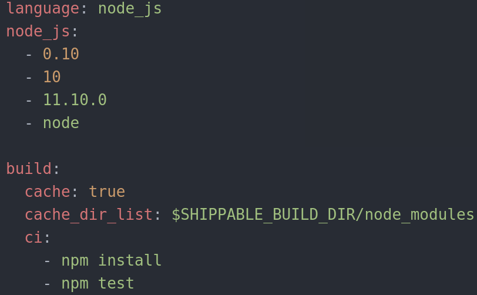
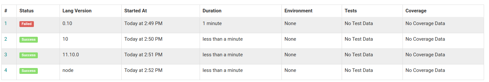

# Shippable

There are several continuous integration systems Shippable,Jenkins,CircleCI,CodeShip,GitLab CI, etc. I have chosen Shippable after look into some of this tools, but I found Shippable easiest and simpler than the others. It is very well [documented](http://docs.shippable.com/ci/why-continuous-integration/) too.
[Shippable](http://docs.shippable.com) helps developers achieve CI/CD and make software releases frequent, predictable, and error-free.

You can sign up with GitHub and to use it you simply authorize Shippable to access to GitHub

Code for .shippable.yml:

- language: specifies the language I use. Node.js in this instance.
- node_js: specify the versions
  - 0.10: is one of the oldest versions, so it probably won't work.
  - 10: is not the oldest nor the newest, something in between. It uses the version 10.23.0, which is the more recent variant of the version.
  - 11.10.0: is the las version that apperars [here](http://docs.shippable.com/platform/runtime/machine-image/language-versions/#nodejs). If version 10 works this version will probably work too.
  - node: it uses the version 15.2.0. Therefore is the version more likely to run.

- This is for avoiding installing node modules each time:
  ~~~
  cache: true
   cache_dir_list:
     - $SHIPPABLE_BUILD_DIR/node_modules
  ~~~

- build ci: this is executes continuous integration tasks.
  - npm install ensure the dependencies are installed.
  - npm test run the tests.

