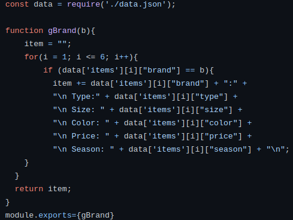
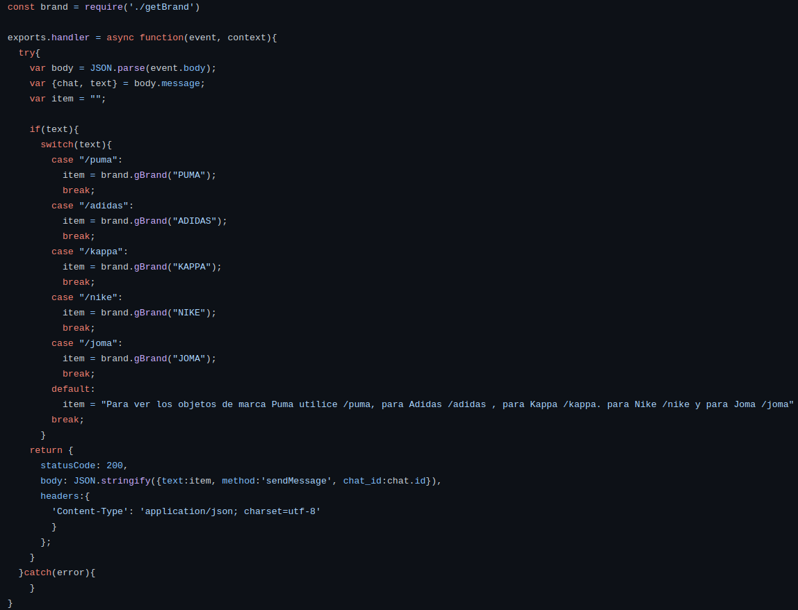
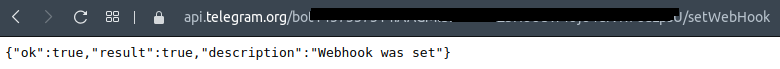
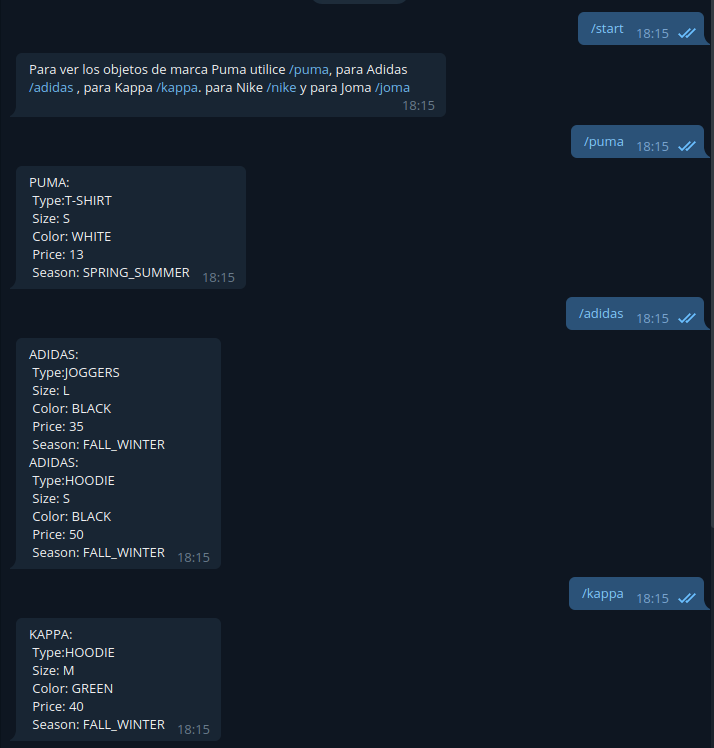
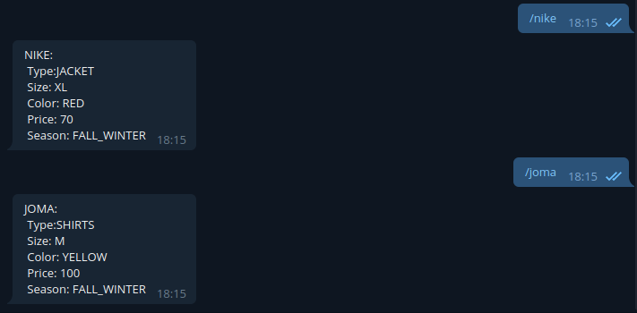

# Serverless Telegram Bot with Netlify

After signing up in Netlify with GitHub we pick a repository to start the deployment we can choose how we want to build it and the publish directory.
To have more advanced settings you can create a netlify.toml file that is going to be far more flexible.

## Code

- getBrand.js: gets the information about an item or items given a brand. This correspond with the user story 1 and and 7. [US:1](https://github.com/miguelfdez99/MyOutlet/issues/2) , [US:7](https://github.com/miguelfdez99/MyOutlet/issues/43)

- brand.js: Handles the bot.
  - /puma: Gets the information about every Puma item
  - /adidas: Gets the information about every Adidas item
  - /kappa: Gets the information about every Kappa item
  - /nike: Gets the information about every Nike item
  - /joma: Gets the information about every Joma item

'exports.handler = async(event,context)' get the event data and send the response later on.

## Webhook

We need to set the webhook if we want to get the bot working. We can do this with the next url `https://api.telegram.org/botTOKEN_BOT/setWebHook?url=URL_NETLIFY`

When the webhook is called , we get the information with:
~~~
  var body = JSON.parse(event.body);
  var {chat, text} = body.message;
~~~

## Bot

[Telegram link](t.me/ivmyoutlet_bot)

