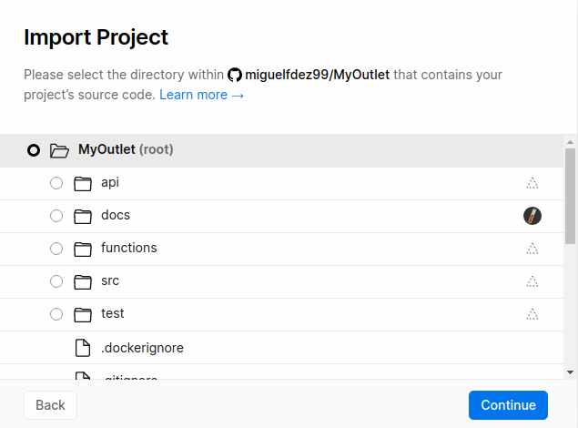
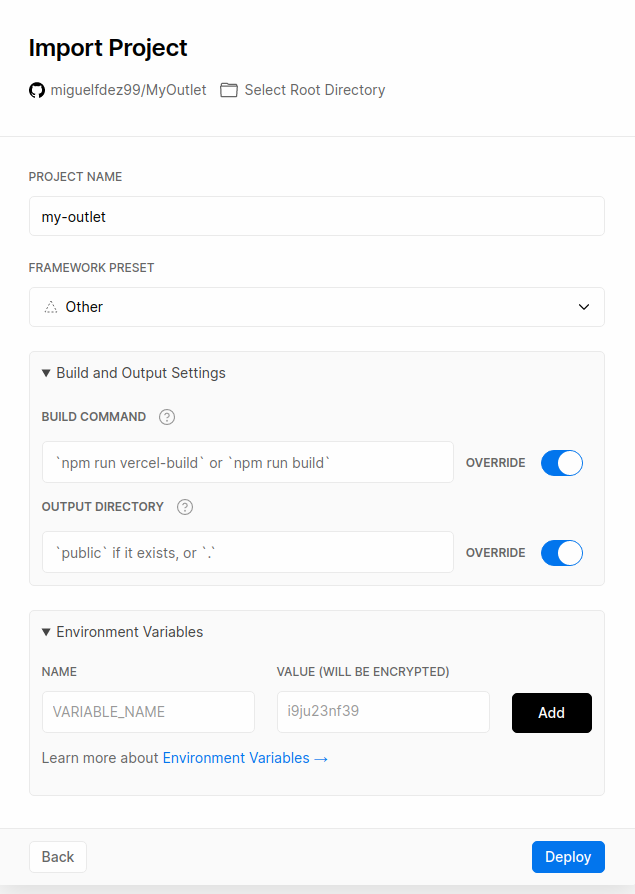
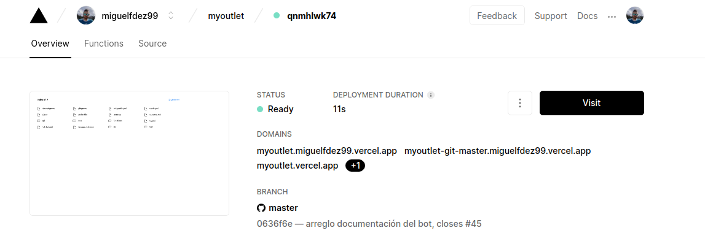
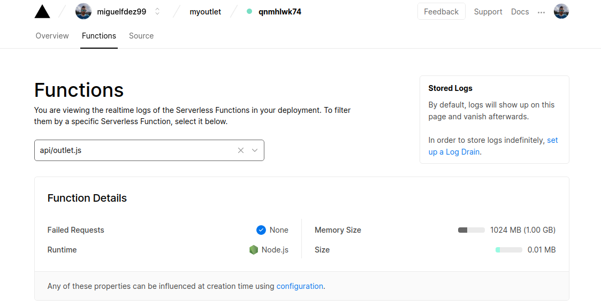

# VERCEL

Vercel is a cloud platform for Serverless Functions. It has plenty of documentation and it is easy to use.

## Connecting with GitHub

To deploy my repository in Vercel I stuck to the [official documentation](https://vercel.com/docs/platform/deployments).

First you have to athorize Vercel to access your GitHub account then you choose which project you want to import.


Then we can choose which folders we want to import. It may looks like choosing everything is not the best choice but the functions probably need to access others directories.





Finally, in order to make the deployment:

- To make a deployment preview:
~~~
$ vercel
~~~

- To make a production deployment
~~~
$ vercel --prod
~~~

Now with every push to my repository Vercel is going to be launch aswell



## Creating a function

Vercel builds functions within the '/api' directory.
I'm going to implement a function to get every spring-summer item in the shop. [HU:6](https://github.com/miguelfdez99/MyOutlet/issues/38)

```
async function Season(){
  var item = "";
  for(let i in data.data.items){
    if(data.data.items[i].season == "SPRING_SUMMER"){
      item = data.data.items[i];
      }
    }
    return item;
  }

```
In order to work it must export a default function handler.

```
module.exports = async (req,res) => {
  try{
    status:200,
    res.send(await Season())
  }catch(error){
    status:400,
    res.send("Error")
  }
}
```
Handle the requests and send back a response.
If it's alright we get a status 200(ok) and proceed with the function, otherwise we get a status 400 and an error message.
- req and res are standard HTTP request and response objects from node.js
- The method send is where we send the data.


As we can see it gets the item correctly.

[Vercel url](https://myoutlet.miguelfdez99.vercel.app/api/outlet.js)



I have created a file with the [data](https://github.com/miguelfdez99/MyOutlet/blob/master/api/data.js) also.
