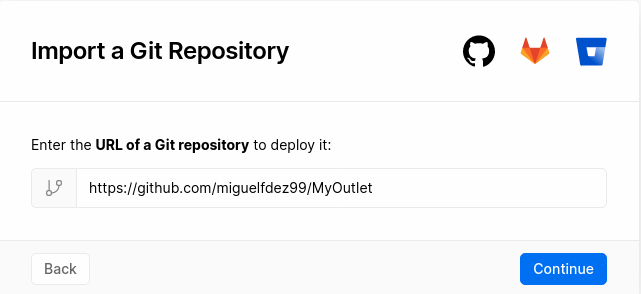
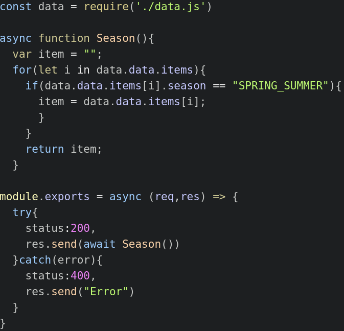
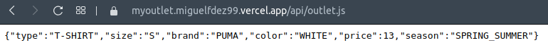

# VERCEL

To deploy my repository in Vercel I stuck to the [official documentation](https://vercel.com/docs/platform/deployments).

First you have to athorize Vercel to access your GitHub account then you choose which project you want to import

Then we can choose which folders we want to import. It may looks like choosing everything is not the best choice but the functions probably need to access others directories.

Finally, in order to make the deployment:

- To make a deplyment preview:
~~~
$ vercel
~~~

- To make a production deployment_
~~~
$ vercel --prod
~~~

Now with every push to my repository Vercel is going to be launch aswell

## Creating a function

I'm going to implement a function to get every spring-summer item in the shop. [User-Story 6](https://github.com/miguelfdez99/MyOutlet/issues/38)

Vercel builds functions within the '/api' directory.In order to work it must export a default function handler.
`module.exports = async (req,res)` handle the requests. It tries to send the function Season with status:200 and if it cannot reach the function it gets an error.

As we can see it gets the item correctly.

[Vercel url](https://myoutlet.miguelfdez99.vercel.app/api/outlet.js)

Additionally I have created a file with the [data](https://github.com/miguelfdez99/MyOutlet/blob/master/api/data.js)
